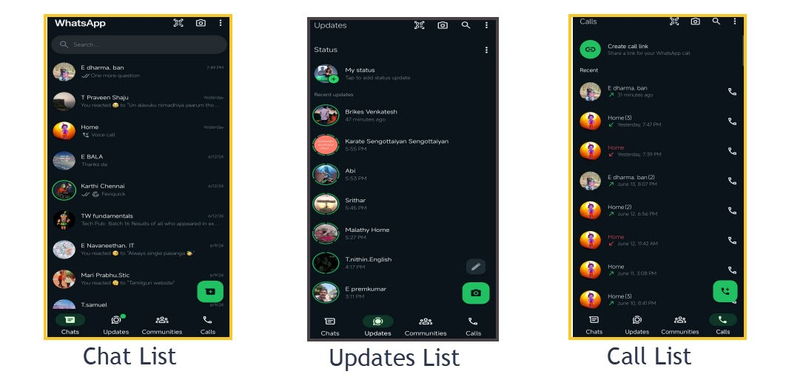
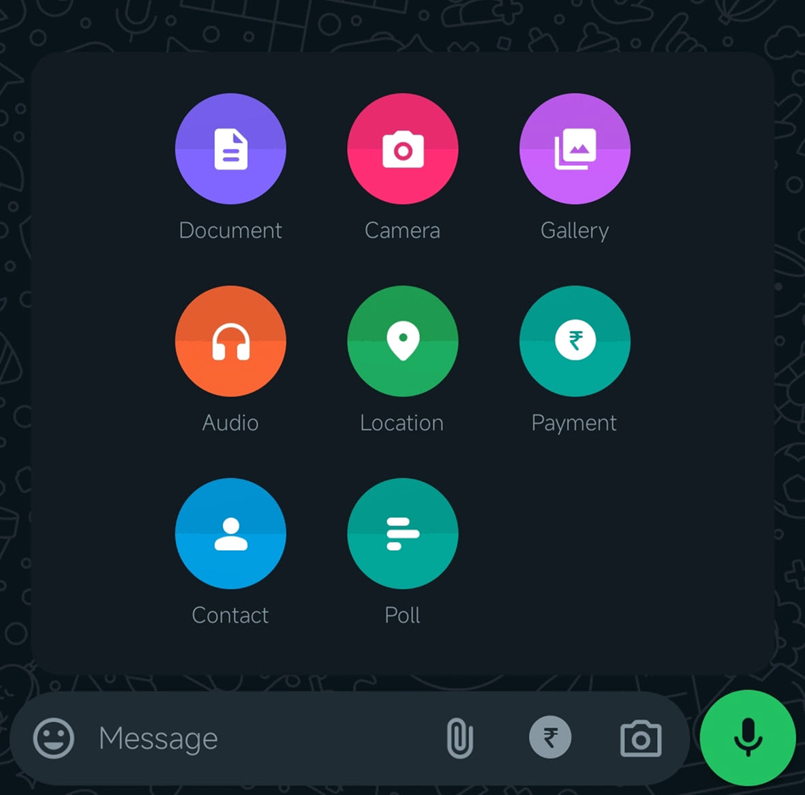

# Understanding a WhatsApp

WhatsApp is an internet-based communication app that helps to connect with people. It provides the features of free messages, audio/video calls, file sharing, and highly secured payment services. It offers personal and business apps based on the needs. Also, these apps provide new technological advancements to improve the quality of the function and security services.

This topic helps you to understand WhatsApp and its features & functions.

**Types of account**
- Personal
- Business

**Benefits** 
- Connect with people through calls and messages.
- Internet-based access to use either Wi-Fi or mobile.
- No cost to make a call anywhere in the world.
- Broadcast and group message facility.

**User**
- All the users who need a private account to communicate.
- Business persons who need to share and communicate with the people for their business purpose.

**Supportive platform**
- Android
- Windows
- iOS
- Mac
- Web

**Features**

The following table shows the available features in the types of WhatsApp accounts.

|Features|Personal account| Bisiness account|
|:-------|:----------:|:-----------:|
|**End-to-end encryption message:** Protect the message from threats.|&check;|&check;|
|**Private messages:** Make a private conversation/ share file with people.|&check;|&check;|
|**Group chat:** Make a conversation with the group of people to share your thoughts.|&check;|&check;|
|**Chat lock:** Provides password protection from others to access the individual conversation.|&check;|&check;|
|**App lock:** Provides password protection from others to access your account.|&check;|&check;|
|**Disappearing messages:** Erase the messages automatically within 24 hours to save your memory.|&check;|&check;|
|**Profile picture:** Add the pictures to show you visually.|&check;|&check;|
|**Username:** Add your name to recognize you.|&check;|&check;|
|**Backup and recovery:** Create a duplicate copy of the information in the cloud to avoid data loss.|&check;|&check;|
|**Read receipts:** The color of the check mark indicates when the receiver receives a message and reads it.|&check;|&check;|
|**Payment:** You can send/receive money through UPI. |&check;|&check;|
|**Updates:** Share your thoughts/feelings.|&check;|&check;|
|**Last seen and online:** it indicates the status of your availability.|&check;|  |
|**About you:** Add a short description of you.|&check;|
|**Communities:** You can create a group to make official/professional conversations.|&check;|  |
|**Business profile:** Add a short description of your business details.| |&check;|
|**Quick reply:** Create a common message to send when someone contacts you for product details.| |&check;|
|**Greeting message:** The new person receives a welcome note when they send a first message.| |&check;|
|**Catalog:** The customer can browse the list of products and offers on your profile.|  |&check;|

**Functions**

- **Text message:** You can chat with your friends or group to share your thoughts and options in text.
- **Calls:** You can have an audio/video conversation between the person or group of people. 
- **Voice message:** You can share the voice note message with the receiver when they are not available to make a call. 
- **File sharing:** You can share documents, contacts, pictures, emojis, and contacts through a message.
- **Poll:** You can ask questions to get answers.
- **Location sharing:** You can share live locations to know where you are exactly.
